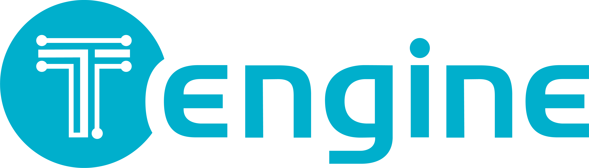

# **关于**

[Tengine Lite](https://github.com/OAID/Tengine) 由 [OPEN AI LAB ](http://www.openailab.com/)主导开发，该项目实现了深度学习神经网络模型在嵌入式设备上的快速、高效部署需求。为实现在众多 AIoT 应用中的跨平台部署，本项目基于原有 Tengine 项目使用 C 语言进行重构，针对嵌入式设备资源有限的特点进行了深度框架裁剪。同时采用了完全分离的前后端设计，有利于 CPU、GPU、NPU 等异构计算单元的快速移植和部署。同时兼容 Tengine 框架原有 API 和 模型格式 tmfile，降低评估、迁移成本。

Tengine Lite 核心代码由 4 个模块组成：

* dev：NN Operators 后端模块，当前提供 CPU 代码，后续逐步开源 GPU、NPU 参考代码；
* lib：框架核心部件，包括 NNIR、计算图、硬件资源、模型解析器的调度和执行模块；
* op：NN Operators 前端模块，实现 NN Operators 注册、初始化；
* serializer：模型解析器，实现 tmfile 格式的网络模型参数解析。
