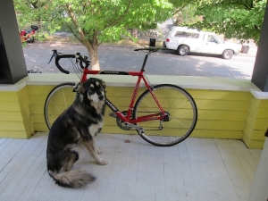
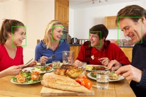
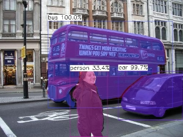

# **Demo展示**

以下所有模型在[Tengine model zoo](https://pan.baidu.com/s/1Ar9334MPeIV1eq4pM1eI-Q)可以找到（密码：hhgc）。


1. **人脸关键点**
---
代码地址：https://github.com/OAID/Tengine/blob/tengine-lite/examples/tm_landmark.cpp
```bash
export LD_LIBRARY_PATH=./build/install/lib
./build/install/bin/tm_landmark -m models/landmark.tmfile -i images/mobileface02.jpg -r 1 -t 1
```
Input Image:        


Output Image:       


2. **ssd目标检测任务**
---
代码地址：https://github.com/OAID/Tengine/blob/tengine-lite/examples/tm_mobilenet_ssd.cpp
```bash
export LD_LIBRARY_PATH=./build/install/lib
./build/install/bin/tm_mobilenet_ssd -m models/mobilenet_ssd.tmfile -i images/ssd_dog.jpg -r 1 -t 1
```
Input Image:        


Output Image:       


3. **retinaface 人脸检测任务**
---
代码地址：https://github.com/OAID/Tengine/blob/tengine-lite/examples/tm_refinaface.cpp
```bash
export LD_LIBRARY_PATH=./build/install/lib
./build/install/bin/tm_retinaface -m models/retinaface.tmfile -i images/mtcnn_face4.jpg -r 1 -t 1
```
Input Image:        


Output Image:       


4. **yolact 实例分割任务**
---
代码地址：https://github.com/OAID/Tengine/blob/tengine-lite/examples/tm_yolact.cpp
```bash
export LD_LIBRARY_PATH=./build/install/lib
./build/install/bin/tm_yolact -m models/yolact.tmfile -i images/ssd_car.jpg -r 1 -t 1
```
Input Image:        


Output Image:       


5. **人体姿态识别任务**
---
代码地址：https://github.com/OAID/Tengine/blob/tengine-lite/examples/tm_openpose.cpp
```bash
export LD_LIBRARY_PATH=./build/install/lib
./build/install/bin/tm_openpose -m models/openpose_coco.tmfile -i image/pose.jpg -r 1 -t 1
```
Input Image:        


Output Image1:      


Output Image2:      

